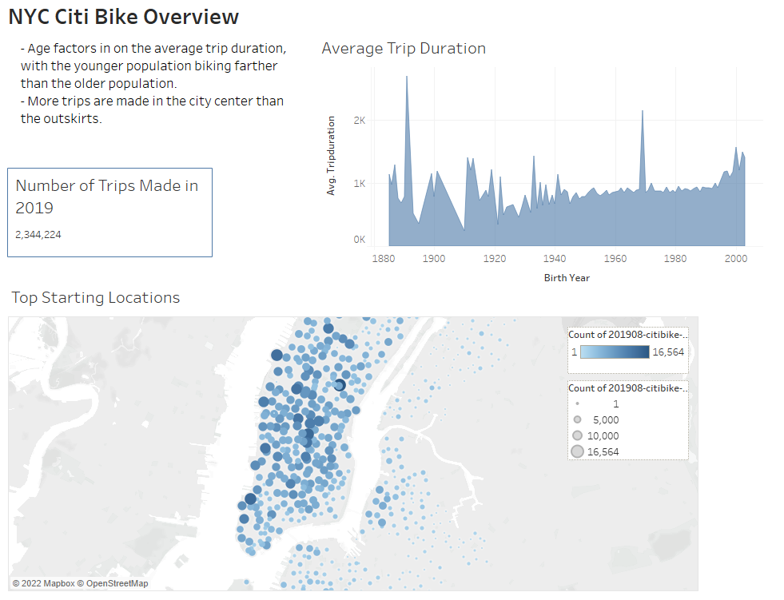
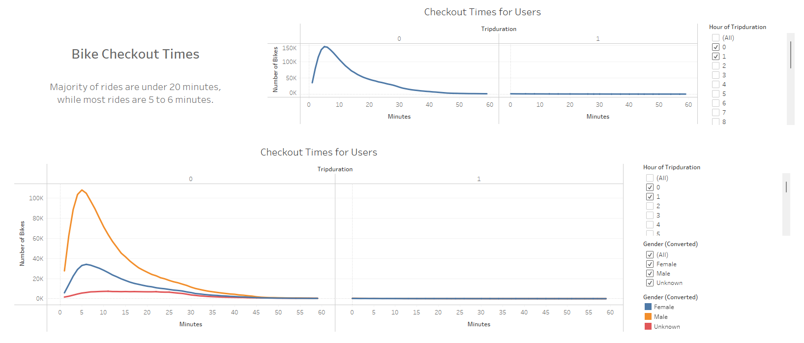
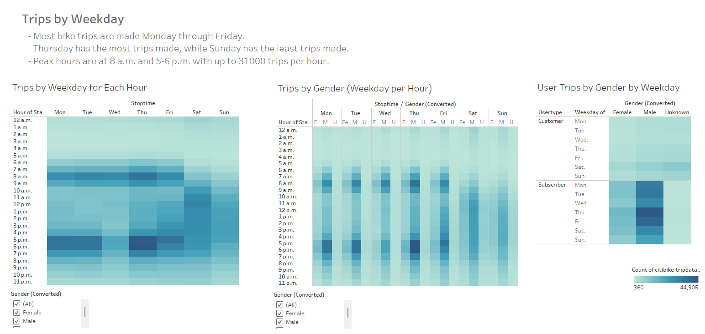

# Bike Sharing

### Overview
This analysis analyses New York City's Citi Bike to provide investors and key share-holders on insights on what the outcome of a bike-sharing program in Des Moines could look like.

### Results

[Link to Public Tableau Dashboard](https://public.tableau.com/app/profile/daniel.mast/viz/Book2_16650920310460/NewYorkCityCitiBikeOverview?publish=yes "link to dashboard")

Left to right, Top to bottom.

##### Average Trip Duration
- The older the person, the less likely the person is to take long trips.

##### Top Starting Locations
- The Top Starting Locations are centered around the city center

Left to right, Top to bottom.

##### Checkout times for Users
- Most rides are under 20 minutes
- Most rides are around 5-6 minutes

##### Checkout times for Users based on Gender
- Females are more likely to take longer bike rides than men

Left to right, Top to bottom.

##### Trips by Weekday for Each Hour
- Most bike trips are made Monday through Friday
- Thursday has the most trips made, while Sunday has the least trips made
- Peak hours are at 8 a.m., and 5-6 p.m. with up to 31000 trips per hour

##### Trips by Weekday for Each Hour per Gender
- Most bike trips are made by males

##### Trips by Weekday for Each Weekday per User, Gender
- Saturdays are the most common day for non subscribers to travel

### Summary
Provide a high-level summary of the results and two additional visualizations that you would perform with the given dataset.
- Weekdays are the most popular days with up to 31000 trips per hour
- Most trips are 5-6 minutes long while most of them are under 20 minutes
- Most trips are done by males

### Additional Visualizations
- It would be good to display a visualization on what locations people bike to, not only from
- It would be interesting to factor in the usage and milage of electric bikes vs normal bikes
